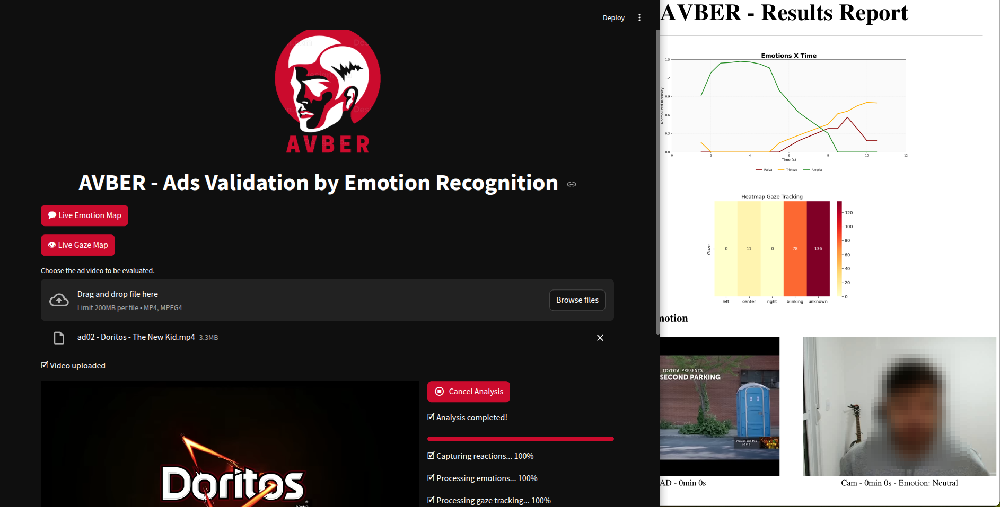

<p align="center">
    
    
    <br>
    <b>Visão Computacional e Realidade Misturada</b>
</p>

<p align="center">
    <b>AVBER - Ads Validator By Emotional Recognition:</b> <i>Integrated analysis of advertising campaigns based on visual and emotional responses from the viewer's cognitive perspective</i>
</p>

---
### **Descrição do Projeto**
- [▶ **Vídeo de demonstração**](https://youtu.be/E7MuDGmdPfQ)
- [🗎 Leia a descrição completa no Google Docs](https://docs.google.com/document/d/16zR-Yyn3FRSrZcztXzChu3yRixsqHoV_HX5oCLeXQ1Q).

<div align="center">
    
</div>

---
### Análise de Atenção em Propagandas
Este projeto tem como objetivo capturar e analisar o comportamento de usuários ao assistirem a uma propaganda em vídeo, utilizando webcam para rastrear emoções e movimentos oculares.

---
### Objetivos
- Exibir uma propaganda em vídeo enquanto captura o rosto do usuário via webcam.
- Rastrear as emoções do espectador ao longo do tempo.
- Rastrear para onde o usuário está olhando na tela.
- Gerar visualizações, como gráficos de emoções e heatmaps.

---
### Tecnologias Utilizadas
| Categoria                | Ferramentas                     |
|--------------------------|----------------------------------|
| **Interface Gráfica**    | Streamlit                       |
| **Processamento de Vídeo** | OpenCV, ffmpeg-python           |
| **Reconhecimento Facial** | FER, DeepFace (opcional)        |
| **Rastreamento Ocular**  | GazeTracking, MediaPipe         |
| **Visualização de Dados** | matplotlib, pandas, numpy       |

- **FER** só funciona com Python 3.6 ou 3.10.
- **FER** requer as bibliotecas: `moviepy==1.0.3`, `tensorflow>=1.7`, `opencv-contrib-python==3.3.0.9`.

---
### Estrutura de Diretórios
```py
.
├── app.py                        # Arquivo principal da aplicação Streamlit
├── report.py                     # Script gerador do relatório PDF
├── assets                        # Pasta com arquivos estáticos usados na interface
│   ├── avber.png                 
│   ├── print.png                 
│   └── PUCMinas.ico              
├── AVBER-Report.pdf              # Relatório PDF gerado e exibido no app
├── data                          # Dados de entrada e resultados brutos da análise
│   ├── ad_*.jpg                  # Frames dos anúncios com metadados de emoção
│   ├── cam_*.jpg                 # Frames da webcam com metadados de emoção
│   ├── emotion_analysis.csv      # Resultados da análise de emoções em formato tabular
│   └── gaze_data.csv             # Dados de rastreamento de olhar exportados
├── LICENSE                       
├── out                           # Arquivos gerados como saída visual
│   ├── emotion_plot.png          
│   ├── heatmap.png               
│   └── webcam_output.mp4         
├── components                    # Módulos de funcionalidades da aplicação
│   ├── emotion_analysis.py       # Análise de emoções via reconhecimento facial
│   ├── gaze_tracker.py           # Módulo de rastreamento de olhar
│   ├── gaze_tracking             # Biblioteca integrada de rastreamento ocular
│   ├── __init__.py               # Torna `components` um pacote Python
│   ├── utils.py                  # Funções auxiliares reutilizáveis
│   └── visualization.py          # Funções de visualização (gráficos, imagens, etc.)
├── README.md                     
├── requirements.txt              # Requisitos padrão para instalação geral
├── requirements_py310_fer.txt    
├── requirements_py310_pygaze.txt 
├── requirements_py312_EyeTracking.txt  
├── src                           # Vídeos de anúncios analisados
│   ├── ad01 - Twin Lotus Toothpaste - 2003 Thailand.mp4
│   ├── ad02 - Doritos - The New Kid.mp4
│   ├── ad03 - Toyota - Yaris 5s Ad.mp4
│   ├── ad04 - UFC - UFC 100 Face the pain.mp4
│   └── ad05 - Nike - Winner Stays.mp4
└── test                         # Testes automatizados do projeto
    ├── test_FER.py              
    └── test_GazeTracking.py     
```

---
### Como Executar
1. Clone o repositório:
    ```bash
    git clone https://github.com/seuusuario/projeto_analise_prop.git
    cd projeto_analise_prop
    ```

2. Instale os requisitos:
    ```bash
    pip install -r requirements.txt
    ```

3. Execute o app:
    ```bash
    streamlit run app.py
    ```

---
### Resultados Esperados
- Captura sincronizada do vídeo e webcam
- Detecção de emoções frame a frame
- Rastreamento de onde o usuário está olhando
- Gráfico com as emoções predominantes
- Heatmap com regiões mais visualizadas do vídeo

---
### Referências

- **DeepFace**: https://github.com/serengil/deepface
- **FER**: https://github.com/justinshenk/fer
- **MediaPipe Face Mesh**: https://github.com/google-ai-edge/mediapipe/blob/master/docs/solutions/face_mesh.md
- **GazeTracking**: https://github.com/antoinelame/GazeTracking

---
### Créditos
Projeto acadêmico para fins de pesquisa e prototipagem de rastreamento atencional.
